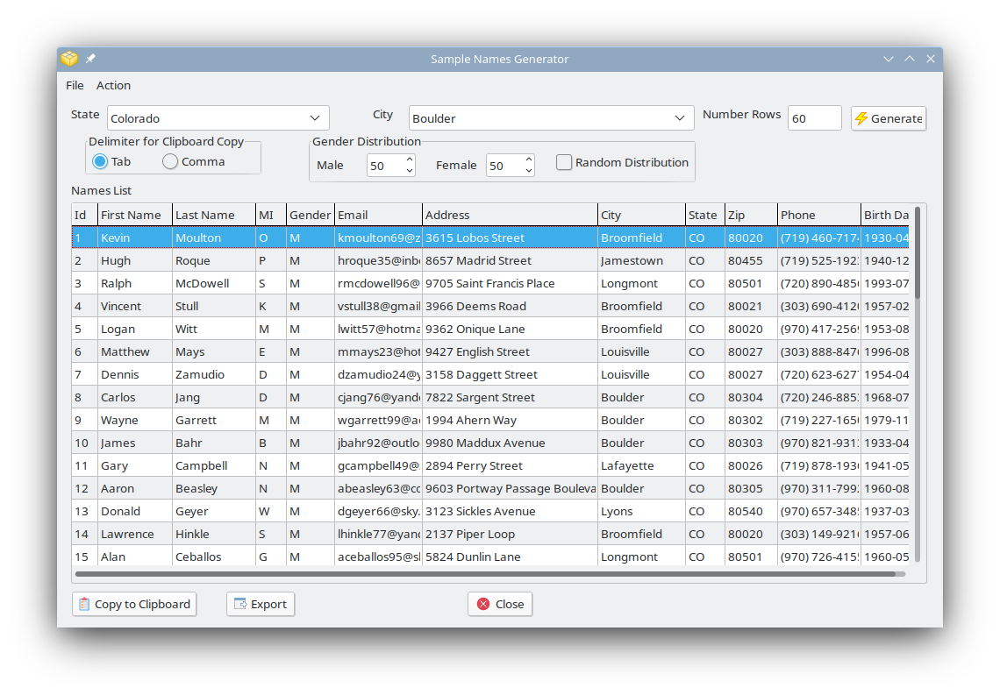

# Sample Names Generator Application

This folder contains the source code for the GUI desktop application for generating sample names and addresses on the fly for a specified state and city.
This application uses a SQLite embedded database (included in this directory) to store the bank of names, cities, US zip codes needed to generate the 
sample data. This application has been tested on both Windows and Linux. A sample screen shot is included below.

 
